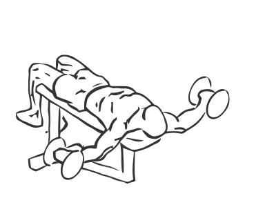
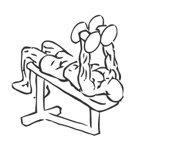

# Decline Dumbbell Fly's

> This is an exercise for chest and shoulder strengthening.

``` 
id: 0053 
type: isolation 
primary: pectoralis major 
secondary: deltoid 
equipment: dumbbells, bench: decline 
``` 


## Steps


 - Lie on a decline bench with your head lower than your body and your feet firmly on the ground.
 - With dumbbells together above your shoulders and your arms straight out above you as your starting position.
 - Keeping your arms straight and with a slight bend in your elbows lower the dumbbells down towards the floor in an arc, up until just above your shoulders.
 - Return to the starting position in a slow controlled manner.
 - Repeat.

## Tips


## Images





