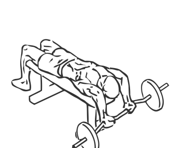
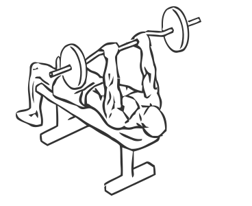

# Triceps Extension: EZ Bar Barbell (Decline)

> This exercise combines a decline bench and a curved bar to more efficiently work the triceps.

``` 
id: 0170 
type: isolation 
primary: triceps brachii 
secondary:  
equipment: barbell 
``` 


## Steps


 - Lay face up on a decline bench and grasp an EZ Bar (Curved Barbell).
 - Extend your arms so they are perpendicular to your chest, and keeping your elbows in one place, lower the bar toward your head.
 - Slowly return to the starting position.

## Tips


## Images





