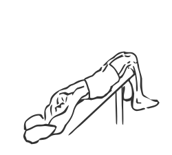
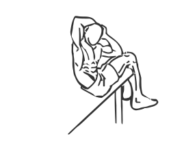

# Decline Oblique Crunch

> This version of a decline crunch isolates the oblique muscles of the abs.

``` 
id: 0293 
type: compound 
primary: abdominals 
secondary:  
equipment: body 
``` 


## Steps


 - This version of a decline crunch isolates the oblique (side) muscles of the abs.
 - Lie on a decline bench face up.
 - Place your feet securely under the pads.
 - Place your hands either across your chest or on either side of your head (over your ears).
 - Raise your shoulders and chest up keeping your back straight and bring your left elbow to your right knee, slowly crunching your abs.
 - Pause for a moment and then return to the starting position.
 - Lay fully back and repeat with your right elbow to your left knee.

## Tips


## Images





