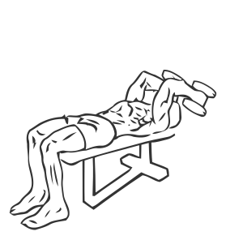
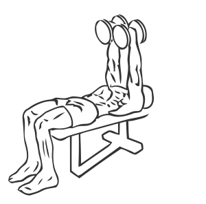

# Triceps Extension: Dumbbell (Decline)

> This exercise combines a decline bench and dumbbells to target the triceps.

``` 
id: 0169 
type: isolation 
primary: triceps brachii 
secondary:  
equipment: dumbbell 
``` 


## Steps


 - Lay face up on a decline bench with a dumbbell in each hand.
 - Extend your arms so they are perpendicular to your chest, and keeping your elbows in one place, lower your hands so the dumbbells are lowered near your head.
 - Slowly return to the starting position.

## Tips


## Images





