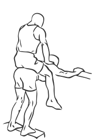
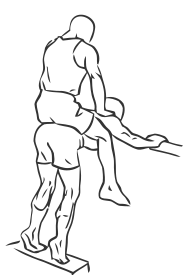

# Donkey Calf Raises

> This is an old school gym exercise which requires the assistance of another person.

``` 
id: 0275 
type: isolation 
primary: gastrocnemius,soleus 
secondary:  
equipment: body 
``` 


## Steps


 - This is an old school gym exercise which requires the assistance of another person. This is an advanced exercise and not recommended for beginners.
 - Bend your waist and lean your arms against a weight rack or bench that is waist height.
 - Have a partner sit on top of your lower back.
 - Raise up on your toes leaning slightly forward.
 - Pause at the top and then lower your heels to the floor.
 - Note: Have a Personal Trainer or Instructor show you how to perform this exercise safely.

## Tips


## Images





