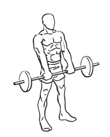
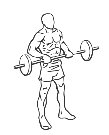

# Drag Curl with Barbell

> This exercise works the biceps and forearms.

``` 
id: 0222 
type: isolation 
primary: biceps brachii 
secondary: forearm 
equipment: barbell 
``` 


## Steps


 - This exercise is credited to the late Vince Gironda, the “Iron Guru”. It not only blasts the biceps and works the forearms as well.
 - Stand with your feet shoulder width apart, your knees slightly bent, and your abs drawn in.
 - Grasp the bar with palms down, shoulder width apart.
 - Extend your arms fully so they are against your thighs.
 - Slowly raise your arms, palms down, to touch your chest.
 - Note: Do not move your elbows or shoulders during this exercise.

## Tips


## Images





