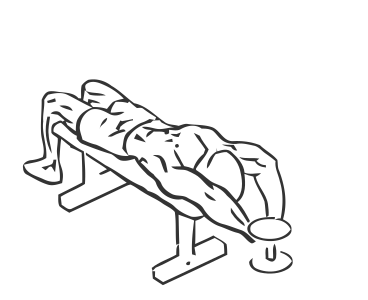
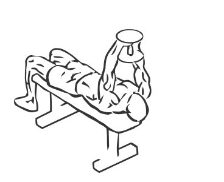

# Dumbbell Bent Arm Pullover

> This is an exercise for chest, shoulder, lats and biceps strengthening.

``` 
id: 0046 
type: isolation 
primary: pectoralis major 
secondary: deltoid,triceps brachii,latissimus dorsi 
equipment: flat bench, dumbbell 
``` 


## Steps


 - Lie flat on a bench with your head hanging slightly over the end and your feet flat on the floor.
 - Hold a dumbbell with both hands, keep your elbows in throughout the exercise.
 - Starting with your arms fully extended over your chest, slowly lower the dumbbell in an arc over your head and towards the floor.
 - Pull the dumbbell back up to chest height in a slow controlled manner and return to starting position.
 - Repeat.

## Tips


## Images





