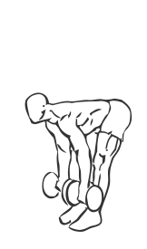
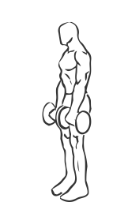

# Dead Lifts: Dumbbell

> This is an exercise for lower back, hamstring and calves strengthening.

``` 
id: 0107 
type: isolation 
primary: erector spinae 
secondary: gastrocnemius,soleus,ischiocrural muscles 
equipment: dumbbells 
``` 


## Steps


 - Grasp 2 dumbbells and stand with your feet shoulder width apart.
 - Keeping your back straight bend at the waist, allow some bend in your knees.
 - Grasp the dumbbells with an overhand grip in each hand.
 - Straighten your back as you hold the dumbbells at arm’s length.
 - Bend over again lowering the dumbbells to just above the floor.
 - Return to starting position.
 - Repeat.

## Tips


 - Do not increase the weight on this exercise until you have mastered the correct form.

## Images





