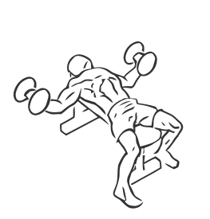
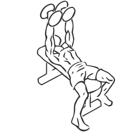

# Dumbbell Flys

> This is an exercise for chest, triceps and shoulder strengthening.

``` 
id: 0056 
type: isolation 
primary: pectoralis major 
secondary: deltoid,triceps brachii 
equipment: flat bench, dumbbells 
``` 


## Steps


 - Lie on a flat bench with a dumbbell in each hand and your feet firmly on the ground.
 - Lift the dumbbells over your chest extending your arms fully with a slight bend in your elbows, this is your starting position.
 - Keeping a slight bend in your elbows, lower the dumbbells to the floor in an arc like motion.
 - Slowly return the dumbbells over your chest to the starting position in a controlled motion.
 - Repeat.

## Tips


 - Ensure your back and hips remain in contact with the bench at all times during this exercise.

## Images





