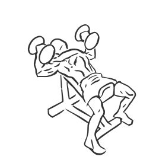
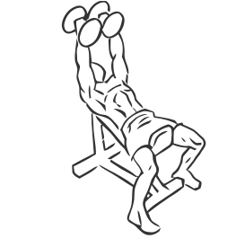

# Bench Press: Dumbbell (Incline)

> This is an advanced exercise for building and sculpting the chest as well as your triceps and shoulders.

``` 
id: 0061 
type: isolation 
primary: pectoralis major 
secondary: triceps brachii,deltoid 
equipment: dumbbells, bench: incline 
``` 


## Steps


 - Lie on an incline bench which has been set to an incline of 45 degrees.
 - Start with the dumbbells at shoulder height, your arms wide and elbows pointing down to the floor.
 - Grasp the dumbbells with a grip so your palms face each other.
 - Raise your arms up over your chest bringing the dumbbells closer together as they meet over your chest, as if you were clapping.
 - Slowly return the dumbbells to starting position.

## Tips


## Images





