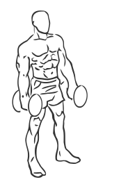

# Lunges: Dumbbell

> This is an exercise for whole leg but mainly hamstring strengthening.

``` 
id: 0115 
type: isolation 
primary: ischiocrural muscles 
secondary: glutaeus maximus,quadriceps,gastrocnemius,soleus 
equipment: dumbbells 
``` 


## Steps


 - Grasp a dumbbell in each hand.
 - Stand with your feet about 8 inches apart, toes facing forward.
 - Take a step forward (2-3 feet) keeping your abs drawn in and your upper body straight.
 - Slowly lower one knee down as if kneeling while keeping your other knee bent at a 90 degree angle, do not let your knee touch the ground.
 - Lower your body so that the rear knee is just above the floor and hold for a moment before returning to the starting position.
 - Repeat on opposite side.

## Tips


 - Ensure not maintain your front knee at a 90 degree angle, in order to prevent knee injury.

## Images




