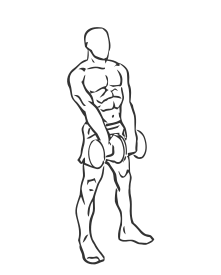
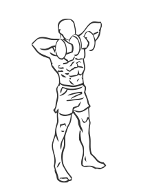

# Upright Row: Dumbbell

> This is an exercise for shoulder, biceps and upper back strengthening.

``` 
id: 0016 
type: isolation 
primary: deltoid 
secondary: biceps brachii,upper back 
equipment: dumbbells 
``` 


## Steps


 - Grasp a dumbbell in each hand with an overhand grip (palms facing downwards) and hold them in front of your thighs.
 - Stand with your feet shoulder width apart, your abs drawn in and your back straight.
 - Starting with the dumbbells at your thighs, slowly raise them up towards your shoulders by bending your elbows.
 - Pause at the top and rotate your shoulder blades together.
 - Lower the dumbbells in a controlled motion to your thighs.
 - Repeat

## Tips


 - Do not arch your back when raising the dumbbells towards your shoulders.
 - Ensure the dumbbells are held close to your body throughout the exercise.
 - Do not perform this exercise if you have wrist, shoulder or elbow pain.

## Images





