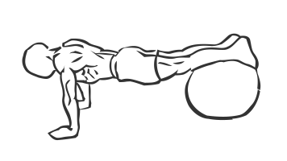
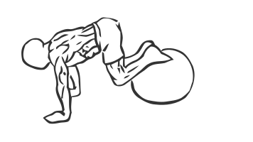

# Exercise Ball Pull In

> This exercise uses a ball to isolate and work the lower abdominal muscles.

``` 
id: 0296 
type: compound 
primary: abdominals 
secondary:  
equipment: body 
``` 


## Steps


 - Lay down as if you were performing a pushup.
 - Place your feet and shins over an exercise or stability ball.
 - Keeping your back straight and supporting your weight on your hands, pull your knees towards your chest, so the ball rolls forward under your ankles.
 - Crunch your abs and then roll the ball back to starting position straighten your legs.
 - Note: Keep your back straight as you perform this exercise.

## Tips


## Images





