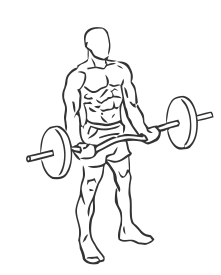
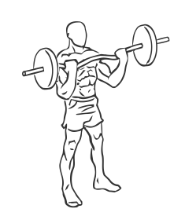

# EZ Bar Curl with Barbell

> This exercise uses an EZ or curl bar to better isolate and build the arms.

``` 
id: 0226 
type: isolation 
primary: biceps brachii 
secondary: forearm 
equipment: barbell 
``` 


## Steps


 - Stand with your feet shoulder width apart and your knees slightly bent.
 - Grasp the barbell with palms up.
 - Lower the bar so it is against your thighs.
 - Keeping your elbows still, raise the bar up to your chest so that your forearms touch your biceps.
 - Note: Lean up against a wall or post to keep yourself from swaying.

## Tips


## Images





