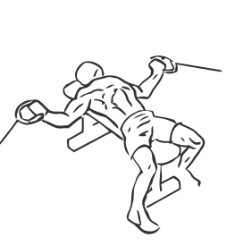
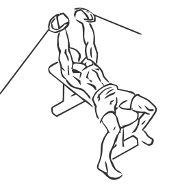

# Flat Bench Cable Flys

> This is an exercise for chest and shoulder strengthening.

``` 
id: 0057 
type: isolation 
primary: pectoralis major 
secondary: deltoid 
equipment: flat bench, cable 
``` 


## Steps


 - <h3> Steps</h3>
 - Lie on flat bench between two cable towers and your feet firmly on the ground.
 - Grasp a pulley in each hand with your palms facing up.
 - With a slight bend in your elbows, squeeze your chest and pull the cables together meeting in the middle of your chest.
 - Hold for a moment and then slowly lower your hands back to starting position at bench height.
 - <h3>Tip</h3>
 - Ensure your back and hips stay in contact with the bench at all times during this exercise.

## Tips


## Images





