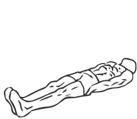
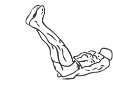

# Flat Bench Leg Raises

> This is an exercise for lower abdominal strengthening.

``` 
id: 0021 
type: isolation 
primary: abdominals 
secondary:  
equipment: body 
``` 


## Steps


 - Lie on a flat bench with your hands under your hips supporting your back.
 - Your legs should be unsupported by the bench from below your knees.
 - With your feet together and your toes flexed upwards, raise your straight legs up a few cm off the bench; both of your legs should have no contact with the bench. This is your starting position.
 - Keep your legs straight with a slight bend in the knees and raise your legs to just before 90 degrees with your hips.
 - Pause at the top and lower your legs in slow controlled manner back to the starting position.
 - Repeat.

## Tips


 - If you are pregnant you should contact your doctor prior to doing this exercise.
 - Ensure your back stays in contact with the bench at all times during this exercise.

## Images





