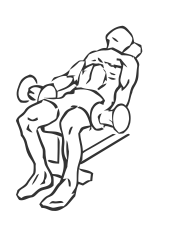
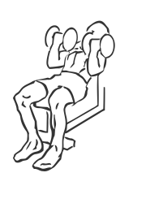

# Flexor Incline Curls with Dumbbell

> This exercise was designed to keep the stress on the biceps.

``` 
id: 0228 
type: isolation 
primary: biceps brachii 
secondary:  
equipment: dumbbell 
``` 


## Steps


 - Sit on an incline bench with your feet firmly on the floor in front of you.
 - Grasp a dumbbell with your palms facing up.
 - Bring your arms down to your sides and while keeping your wrists as straight as possible, raise your wrists to your shoulders.
 - Concentrate on squeezing your biceps as you contract (raise) your arms.

## Tips


## Images





