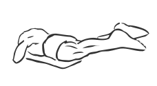
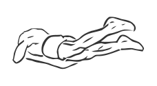

# Flutter Kicks

> This is an exercise for quadriceps and hamstring strengthening.

``` 
id: 0116 
type: isolation 
primary: ischiocrural muscles 
secondary: quadriceps 
equipment: flat bench 
``` 


## Steps


 - Lie face down on a bench with your hips on the edge, hold onto the bench with your hands.
 - Allow your legs and toes hang down.
 - Draw your abs in, squeeze your gluts and hamstrings.
 - Kick each back and up while keeping your hips on the bench.
 - Alternate kicking each leg.

## Tips


## Images





