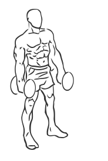
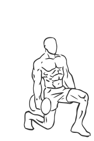

# Forward Lunge with Bicep Curl using Dumbbell

> This exercise combines a forward lunge with a bicep curl.

``` 
id: 0265 
type: compound, isolation 
primary: biceps brachii 
secondary: gastrocnemius,soleus,hip abductors,forearm,ischiocrural muscles,glutaeus maximus 
equipment: dumbbell 
``` 


## Steps


 - Grasp a dumbbell in each hand with your palms facing up.
 - Stand with your feet together, your back straight and your abs drawn in.
 - Allow your arms to extend down fully to the sides of your body.
 - While keeping your body straight, take a step forward then bend your waist and your knee into a lunge.
 - Be careful not to let your back knee drop to the floor.
 - As you go into the lunge, curl your arms up towards your shoulders, contracting your biceps.
 - Return to starting position and switch legs.
 - Note: Have a Personal Trainer or Instructor show you how to properly perform this exercise.

## Tips


## Images





