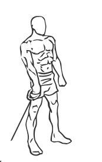
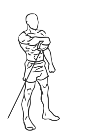

# Front Cable Raises

> An exercise for shoulders, chest and forearm strengthening.

``` 
id: 0008 
type: isolation 
primary: deltoid 
secondary: pectoralis major,forearm 
equipment: cable 
``` 


## Steps


 - Place the pulley on the setting just above the floor.
 - Stand with your feet shoulder width apart, your abs drawn in and your knees slightly bent.
 - Starting at waist height, take the pulley in your left hand, palm facing the floor with otherwise known as an overhand grip, and raise your straight arm up towards your left shoulder.
 - At shoulder height pause for a moment.
 - With a controlled movement resist the weight and slowly lower your arm back to starting position at your waist.
 - Repeat the exercise with your right arm.

## Tips


 - Maintain a good posture at all times during this exercise ensuring not swaying or arching at your back.
 - Do not perform this exercise if you have shoulder pain.

## Images





