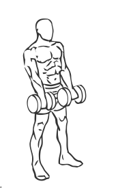
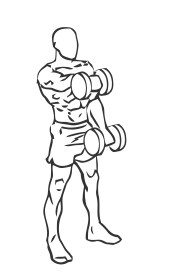

# Front Dumbbell Raise

> This is an exercise for shoulder strengthening.

``` 
id: 0033 
type: isolation 
primary: deltoid 
secondary:  
equipment: dumbbells 
``` 


## Steps


 - Stand with a dumbbell in each hand with an overhand grip, your feet shoulder width apart and your abs drawn in.
 - Keeping each arm straight raise your left arm to just above shoulder height.
 - Pause for a moment then in a controlled motion lower the weight to starting position and repeat with your right arm.
 - <h3></h3>

## Tips


## Images





