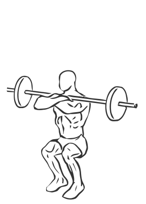
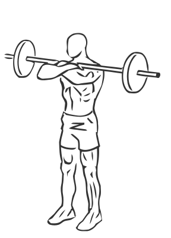

# Front Squat with Barbell

> The Front Squat works the same muscles as the rear squat without placing the weight of the bar on your shoulders.

``` 
id: 0138 
type: compound 
primary: quadriceps 
secondary: ischiocrural muscles,gastrocnemius,soleus 
equipment: barbell 
``` 


## Steps


 - The Front Squat works the same muscles as the rear squat without placing the weight of the bar on your shoulders. This exercise can be a good substitute for people with back and neck injuries.
 - Place the barbell on your upper chest, resting it across your front deltoids and holding it with your arms crossed securely.
 - Keep your head and back straight, abs drawn in and toes pointing slightly outward.
 - Slowly “squat” down so your upper thighs are parallel to the floor.
 - Slowly return to the starting position.
 - Note: Practice the squat without any weight to allow yourself to become comfortable with the movements.

## Tips


## Images





