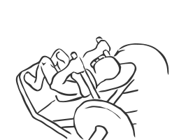

# Hack Squat: Machine

> This exercise is a variation of the Squat which uses a machine.

``` 
id: 0123 
type: compound 
primary: quadriceps 
secondary: ischiocrural muscles,gastrocnemius,soleus 
equipment: machine 
``` 


## Steps


 - This exercise is a variation of the Squat which uses a machine.  This exercise may be preferred by beginners.
 - Lie face up on a Hack Squat machine with your shoulders against the pad.
 - Place your feet facing forward at slightly less than shoulder width apart with your toes point slightly outward.
 - Release the dock levers and place your hands on the hand grips.
 - Drawing your abs in, extend your body standing upright.
 - Lower your body to a squatting position so you knees are bent as if you were sitting down.
 - Return to the starting position.

## Tips


## Images




