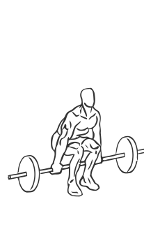
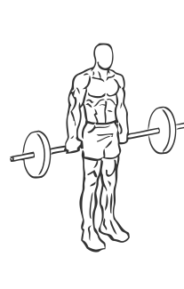

# Hack Squat: Barbell

> This is another variation of the basic Squat that focuses primarily on the quadriceps or thigh muscles.

``` 
id: 0125 
type: compound 
primary: quadriceps 
secondary: ischiocrural muscles 
equipment: barbell 
``` 


## Steps


 - This is another variation of the basic Squat that focuses primarily on the quadriceps or thigh muscles.
 - Place the barbell on the floor just behind your legs and stand with your feet shoulder width apart with your toes pointing forward.
 - With your feet firmly placed on the floor, reach down and grasp the barbell from behind with an overhand grip.
 - Lift the barbell by extending your hips and knees, taking care not to lock your knees.
 - Lower yourself (squat) down until your thighs are parallel to the floor.
 - Slowly raise yourself up to starting position.

## Tips


## Images





