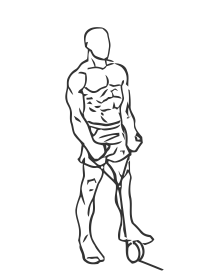
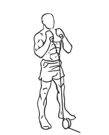

# Hammer Curls with Rope and Cable

> Using the rope with the cable machine allows you isolate the biceps with this version of the Hammer Curl.

``` 
id: 0216 
type: isolation 
primary: biceps brachii 
secondary:  
equipment: cable 
``` 


## Steps


 - Using the rope with the cable machine allows you isolate the biceps with this version of the Hammer Curl. This is a good exercise for beginners.
 - Attach a rope to a cable pulley to the bottom of the weight stack. Stand with your feet shoulder width apart, your knees slightly bent and your abs drawn in. Grasp the rope with a close underhand grip (palms facing up). Lower your arms fully to above your thighs and bending only your elbows, raise the rope to your upper chest. Pause for a moment and then return to the starting position.
 - Note: Keep your elbows at your side throughout this exercise. Do not swing your hips or back during this exercise.

## Tips


## Images





