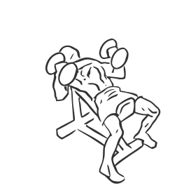
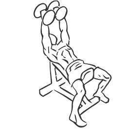

# Bench Press: Dumbbell (Incline, Hammer Grip)

> This is an advanced exercise for strengthening the chest, triceps and shoulders.

``` 
id: 0059 
type: isolation 
primary: pectoralis major 
secondary: deltoid,triceps brachii 
equipment: dumbbells, bench: incline 
``` 


## Steps


 - Grasp a dumbbell in each hand and lay on an incline bench set at a 45 degree angle.
 - Keep your feet flat on the floor and your back against the bench at all times.
 - Using a hammer grip (with your palms facing each other), lift the weights to shoulder height on either side of your chest.
 - Extend your arms fully and press the dumbbells up.
 - Slowly return the dumbbells to the starting position at the sides of your chest.

## Tips


## Images





