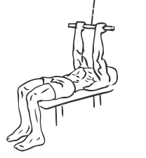
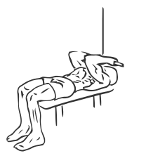

# High Cable Curls

> This exercise allows you to target the muscles of your arms from a different position.

``` 
id: 0229 
type: isolation 
primary: biceps brachii 
secondary: triceps brachii 
equipment: cable 
``` 


## Steps


 - Place a flat bench next to a cable weigh stack.
 - Attach a short bar to the high pulley.
 - Lay on your back with your head towards the stack.
 - Grip the bar with palms facing you)and extend your arms fully on a slight angle over your head.
 - Pull the bar down towards you, curling your arms as much as possible.
 - Slowly return to the starting position.

## Tips


## Images





