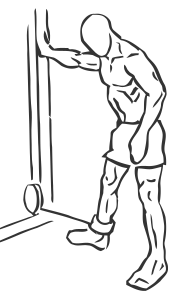
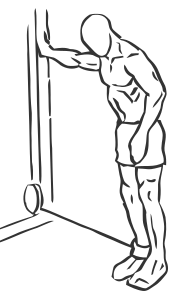

# Hip Adduction

> This exercises strengthens hip flexors and muscles of the thighs.

``` 
id: 0135 
type: isolation 
primary: quadriceps 
secondary: hip abductors 
equipment: cable 
``` 


## Steps


 - Stand alongside a cable pulley stack and attach a cuff to the pulley and your ankle.
 - Step away from the stack, holding onto the stack for support.
 - Standing firm on the foot not attached to the cable and slowly abduct, or pull, your cuffed ankle in front of your stabilizing leg.
 - Repeat and switch ankles.

## Tips


## Images





