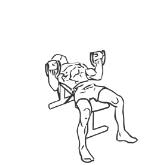

# Bench Press: Bands (Incline)

> This is an exercise for chest and biceps strengthening.

``` 
id: 0044 
type: isolation 
primary: pectoralis major 
secondary: biceps brachii 
equipment: exercise band, bench: incline 
``` 


## Steps


 - Securely fasten the band under the leg of a flat bench, near your head.
 - Lie flat on the bench with your feet flat on the floor in order to stabilise your movements.
 - Grasp one end of the band in each hand and starting with your hands at chest level.
 - Press upwards so your arms are fully extended.
 - With a slow controlled motion return to starting position.

## Tips


## Images




