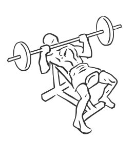
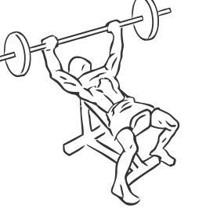

# Bench Press: Barbell (Incline)

> This is an exercise for chest and triceps strengthening.

``` 
id: 0043 
type: isolation 
primary: pectoralis major 
secondary: triceps brachii 
equipment: bench: incline, barbell 
``` 


## Steps


 - Lie flat on an incline bench set at a 45 degree angle, with your feet shoulder width apart.
 - Grasp the bar a little wider than shoulder width apart.
 - Raise the barbell above your body and move it over the middle of your chest, this is your starting position.
 - Lower the bar down so it just touches your chest.
 - Raise the bar straight up till your arms are fully extended and your elbows are locked.
 - Return to starting position.

## Tips


 - Do not bounce the bar off your chest always maintain a controlled motion.

## Images





