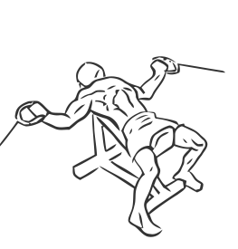
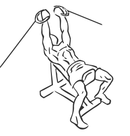

# Incline Cable Fly's

> This exercise is an alternative to the Butterfly or Pec Deck, it defines the muscles of the chest.Place an incline bench set at a 45 degree angle between two cable towers.

``` 
id: 0060 
type: isolation 
primary: pectoralis major 
secondary: biceps brachii,triceps brachii,forearm 
equipment: bench: incline, cable 
``` 


## Steps


 - Place an incline bench set at a 45 degree angle between two cable towers.
 - Grasp a pulley in each hand with your palms facing up.
 - With a slight bend in your elbows, squeeze your chest and pull the cables in an arc so they meet together in the middle of your chest.
 - Hold for a moment and then slowly lower your hands back to starting position at along the same arc.

## Tips


## Images





