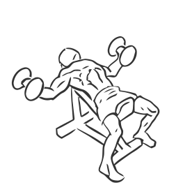
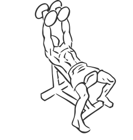

# Incline Dumbbell Fly's

> This is an exercise for chest sculpting and strengthening.

``` 
id: 0062 
type: isolation 
primary: pectoralis major 
secondary: deltoid 
equipment: bench: incline, dumbbells 
``` 


## Steps


 - Lie on an incline bench set a 45 degree angle with a dumbbell in each hand and your feet firmly on the ground.
 - Lift the dumbbells over your chest extending your arms fully and your palms facing each other.
 - Keeping a slight bend in your elbows, lower the dumbbells towards the floor in and arc like motion.
 - Slowly return to starting position.

## Tips


 - Ensure your hips and back remain in contact with the bench throughout the exercise.

## Images





