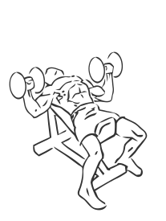
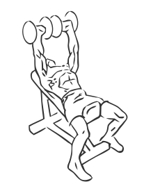

# Incline Dumbbell Press

> This exercises is for mainly chest strengthening but also strengthens your triceps and shoulders.

``` 
id: 0080 
type: isolation 
primary: pectoralis major 
secondary: triceps brachii,deltoid 
equipment: dumbbells, bench: incline 
``` 


## Steps


 - Set and incline bench at a 45 degree angle.
 - Start with the dumbbells at shoulder height, your arms wide and elbows pointing down to the floor.
 - Raise your arms up over your chest bringing the dumbbells closer together as they meet over your chest.
 - Slowly return the dumbbells to starting position.
 - Repeat.

## Tips


## Images





