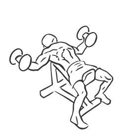
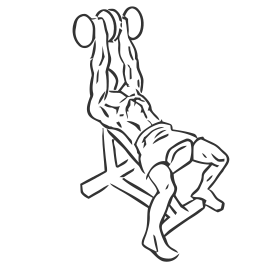

# Incline Fly's with a Twist

> This is an exercise for chest sculpting and strengthening which is very similar to the incline fly's.

``` 
id: 0063 
type: isolation 
primary: pectoralis major 
secondary: deltoid 
equipment: bench: incline, dumbbells 
``` 


## Steps


 - Lie on an incline bench set at a 45 degree angle with a dumbbell in each hand and your feet flat on the ground.
 - Start with the dumbbells out to the sides of your chest, parallel to the floor as you would a regular Fly.
 - Raise the dumbbells over your chest in and arc, at the top turn your pinky finger in so they are facing each other.
 - Slowly return to starting position.
 - Repeat.

## Tips


 - Ensure your hips and back remain in contact with the bench at all times throughout the exercise.

## Images





