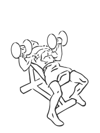
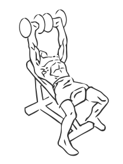

# Incline Shoulder Press Dumbbell

> This is an exercise for shoulder strengthening.

``` 
id: 0031 
type: isolation 
primary: deltoid 
secondary:  
equipment: dumbbell 
``` 


## Steps


 - Lie down on an incline bench with your feet flat on the floor and grasp the dumbbells.
 - With your elbows bent raise your arms up until in line with your shoulders this is your starting position.
 - With your abs drawn in, raise the dumbbells as high as you are able above your shoulders.
 - Lower the dumbbells in a slow controlled manner to starting position.

## Tips


## Images





