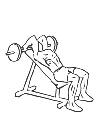
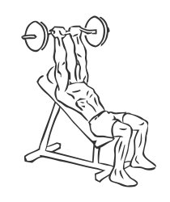

# Triceps Extension: Barbell (Incline)

> This version of a triceps extension uses gravity to increase the resistance of the exercise.

``` 
id: 0174 
type: isolation 
primary: triceps brachii 
secondary:  
equipment: barbell 
``` 


## Steps


 - Grasp a barbell with a close grip (4-6 inches apart).
 - Lie on an incline bench and hold the bar over your head.
 - Lower your arms in a slight arc so your forearms are touching your biceps.
 - Slowly return back to the starting position with the bar over your head.

## Tips


## Images





