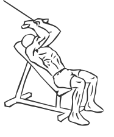
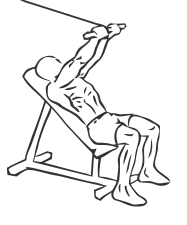

# Triceps Extension: Cable (Incline)

> This exercise uses cables to isolate and work the triceps.

``` 
id: 0164 
type: isolation 
primary: triceps brachii 
secondary:  
equipment: cable 
``` 


## Steps


 - This exercise uses cables to isolate and work the triceps (muscles on the back of the arms).
 - Place an incline bench facing away from a cable pulley.
 - Attach a short straight bar to the pulley and adjust the height so that your arms can extend fully.
 - Lie face up on the bench and grasp the bar with a narrow overhand grip.
 - Starting with your elbows bent overhead, slowly lower the bar towards your feet.
 - Pause at the bottom and then return to starting position.

## Tips


## Images





