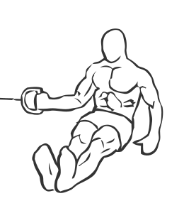
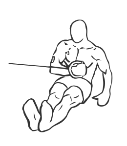

# Internal Cable Rotation

> This is an exercise for shoulder and biceps strengthening.

``` 
id: 0034 
type: compound 
primary: deltoid 
secondary: biceps brachii 
equipment: cable 
``` 


## Steps


 - Sit on the floor with your body close to low cable pulley.
 - Grasp the pulley with your left arm and position your elbow bent at 90 degree angle.
 - Pull the cable towards your body and internally rotate your shoulder until your forearm is across your abs.
 - Return to starting position.
 - Repeat with right arm.

## Tips


 - Ensure your back is straight throughout the exercise.

## Images





