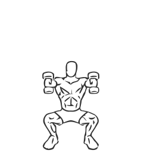
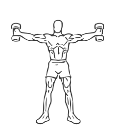

# Iron Cross: Dumbbell

> This is an advanced exercise that works the whole body.

``` 
id: 0140 
type: compound 
primary: quadriceps 
secondary: trapezius,glutaeus maximus,deltoid,erector spinae,ischiocrural muscles 
equipment: dumbbells 
``` 


## Steps


 - With a dumbbell in each hand, stand in a low squat stance, your feet shoulder width arms held out in front of you with your palms facing in.
 - Standing upright, move your arms out and away from your body forming a “T” or “cross”.
 - Note: Do this exercise with light weights until you are comfortable with the movements.

## Tips


## Images





