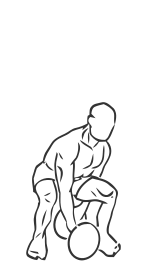
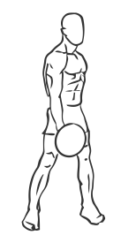

# Jefferson Squats: Barbell

> This exercise builds and shapes the inner thighs.

``` 
id: 0141 
type: compound 
primary: ischiocrural muscles 
secondary:  
equipment: barbell 
``` 


## Steps


 - This is a rarely used exercise which is without question one of the best exercises for building and shaping the inner thighs.
 - Place a barbell between your legs so it is perpendicular to your feet.
 - Grasp the barbell with one hand in front of you and one hand behind you with an overhand grip.
 - Squatting down so your thighs are parallel to the floor slowly lift the weight up between your legs as you stand.
 - Slowly return to a starting position just above the floor.

## Tips


## Images





