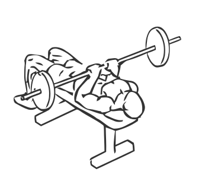

# JM Press

> This is an advanced exercise used by bodybuilders and power lifters to build explosive power in the triceps muscle.

``` 
id: 0175 
type: compound 
primary: triceps brachii 
secondary: deltoid 
equipment: barbell 
``` 


## Steps


 - This exercise is named after the inventor, J.M. Blakley. This is an advanced exercise used by bodybuilders and power lifters to build explosive power in the triceps muscle (back of the arms).
 - Lay on a flat bench with your head just at the end of the bench.
 - Grasp the bar with a medium overhand grip keeping your elbows close to your side, over your sternum (mid chest).
 - Lower the bar towards your sternum at a regular pace, then pause for a moment.
 - With a controlled but rapid pace, push the bar back to starting position.
 - Note: The bar should move in straight line, up and down.

## Tips


## Images




