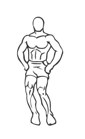
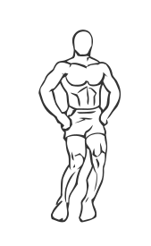

# Knee Circles

> This is a simple exercise and a great stretch.

``` 
id: 0277 
type: compound 
primary: gastrocnemius,soleus 
secondary: ischiocrural muscles 
equipment: body 
``` 


## Steps


 - Stand with your feet a little closer than shoulder width apart.
 - Keeping your arms across your chest or on your hips, move your knees in a circular motion, paying attention to keeping your feet flat on the floor and the movement in your ankles.
 - Note: Do not perform this exercise is you have rolled or unstable ankles.

## Tips


## Images





