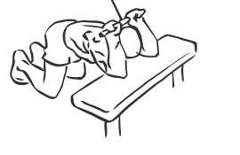
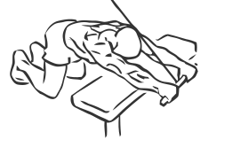

# Triceps Extension: Cable (Kneeling)

> Kneeling allows you to isolate your triceps more effectively.

``` 
id: 0177 
type: isolation 
primary: triceps brachii 
secondary:  
equipment: cable 
``` 


## Steps


 - Place a bench sideways in front of a high pulley machine.
 - Grasp a straight bar with an over head grip.
 - Kneel on the floor in front of the bench with your back straight and your head down.
 - With your elbows and forearms above your head, push the bar down in an arc so that your forearms are touching the bench.
 - Note: Keep your abs drawn in and your back straight as you perform this exercise.

## Tips


## Images





