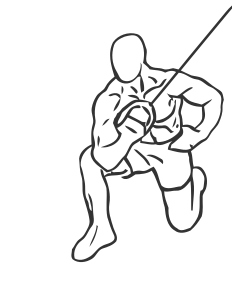

# Kneeling Triceps Concentration Extension with Cable

> Concentration exercises limit your range of movement to increase the effectiveness of the movement.

``` 
id: 0176 
type: isolation 
primary: triceps brachii 
secondary:  
equipment: cable 
``` 


## Steps


 - Attach a stirrup handle to a cable pulley and adjust the pulley up high.
 - Kneeling on your left knee, with the left side of your body turned towards the machine, keep your right leg bent and the upper portion of your thigh parallel to the floor.
 - With your right elbow and upper arm pressed against your inner thigh just above your knee, pull the cable down towards the floor in a slight arcing motion.
 - Slowly to return to starting position.
 - Repeat and switch arms.
 - Note: Keep all of your body still except the arm you are exercising.

## Tips


## Images




