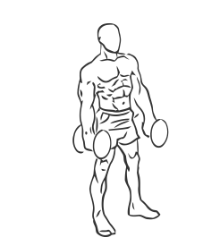
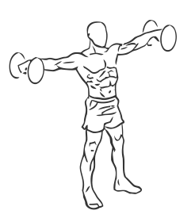

# Lateral Dumbbell Raises

> This is an exercise for lateral deltoid, shoulder and forearm strengthening.

``` 
id: 0018 
type: isolation 
primary: deltoid 
secondary: forearm 
equipment: dumbbells 
``` 


## Steps


 - Grasp a dumbbell in each hand, palms facing inward towards your body and the dumbbells at your sides.
 - Standing with your feet shoulder with apart, draw your abs in and bend your knees slightly.
 - While keeping your torso still, raise the your arms up to the sides keeping your arms straight with a slight bend in the elbows.
 - Raise your arms up until in line with your shoulders, your palms should face the floor.
 - Hold the position for a moment then in a controlled movement lower your arms to the starting position.
 - Repeat

## Tips


 - Maintain a good upright posture ensuring no arching in the back in order to prevent injuries.

## Images





