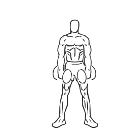

# Lateral Lunge with Bicep Curl with Dumbbell

> This is an advanced exercise that combines a lateral lunge with a bicep curl.

``` 
id: 0264 
type: compound, isolation 
primary: quadriceps,biceps brachii 
secondary: forearm,ischiocrural muscles,glutaeus maximus,gastrocnemius,soleus,hip abductors 
equipment: dumbbell 
``` 


## Steps


 - Grasp a dumbbell in each hand with your palms facing up.
 - Stand with your feet together, your back straight and your abs drawn in.
 - Allow your arms to extend down fully in front of your thighs.
 - While keeping your body straight, take a step sideways and then bend your waist and your knee into a lunge.
 - As you go into the lunge, curl your arms up towards your shoulders contracting your biceps.
 - Return to starting position and switch legs.
 - Note: Have a Personal Trainer or Instructor show you how to properly perform this exercise.

## Tips


## Images




