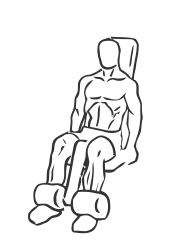
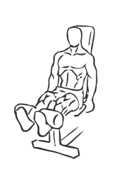

# Leg Extensions

> This exercise is a staple for building strong legs.

``` 
id: 0142 
type: isolation 
primary: quadriceps 
secondary:  
equipment: machine 
``` 


## Steps


 - Adjust the seat so that your knees have full range of motion and that the footpad fits over your legs, just above your ankles.
 - Grasp the handles with your hands for support, keeping your hip and back against the bench.
 - Slowly extend your legs until your knees are straight, but do not lock your knees.
 - Hold for a moment and then with controlled movements return to the starting position.
 - Note: Use controlled movements for this exercise, do not swing the weight up.

## Tips


## Images





