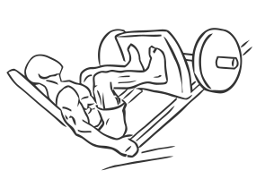
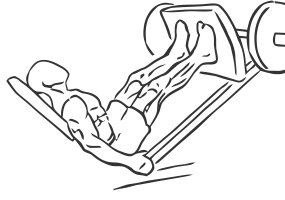

# Leg Press

> This exercise is crucial for building and strengthening the legs.

``` 
id: 0127 
type: compound 
primary: quadriceps 
secondary: gastrocnemius,soleus,ischiocrural muscles 
equipment: machine 
``` 


## Steps


 - Along with the Squat, this exercise is crucial for building and strengthening the legs.
 - Adjust the seat of the machine so that your feet comfortably reach the crosspiece with a slight bend in your knees.
 - To begin, press your feet forward at a shoulder width stance and release the safety locks.
 - Slowly lower the weight towards your body, keeping your abs drawn in and your knees moving in the same direction as your feet to a 90 degree angle.
 - Do not lock your knees or bounce the weight.

## Tips


## Images





