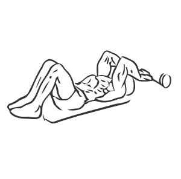
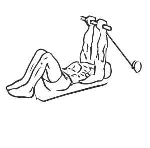

# Triceps Extension: Cable (Low)

> This exercise is done while lying on a seated row station.

``` 
id: 0178 
type: isolation 
primary: triceps brachii 
secondary:  
equipment: cable 
``` 


## Steps


 - Attach a rope to the cable pulley at of a seated row station.
 - Lie on your back on the bench with your head facing the weight stack.
 - Grasp the rope with your palms facing each other and raise your arms over your chest, with your forearms parallel to the floor at a 90 degree angle.
 - Slowly extend your arms upward squeezing your triceps.
 - Return to starting position.

## Tips


## Images





