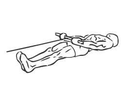
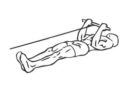

# Lying Bicep Cable Curl

> By lying down you are able to isolate the muscles of your biceps without standing or sitting.

``` 
id: 0232 
type: isolation 
primary: biceps brachii 
secondary: forearm 
equipment: cable 
``` 


## Steps


 - Attach a short bar to a cable pulley set on the lowest setting.
 - Lie down on a mat or the floor with your feet touching the weight stack.
 - Grasp the bar with and palms facing up.
 - With your arms fully extended and your elbows at your sides, pull the bar in an arc to your chest.
 - Pause for a moment contracting your biceps, and then return to the starting position.

## Tips


## Images





